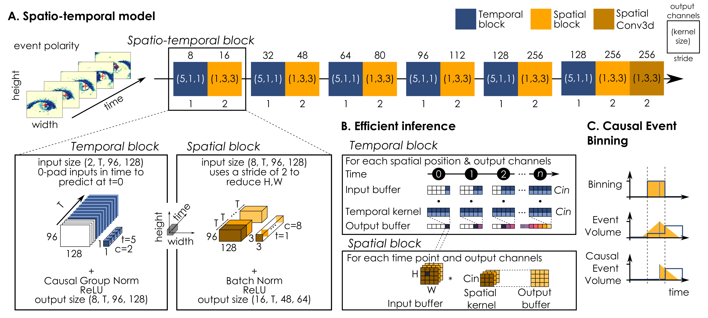
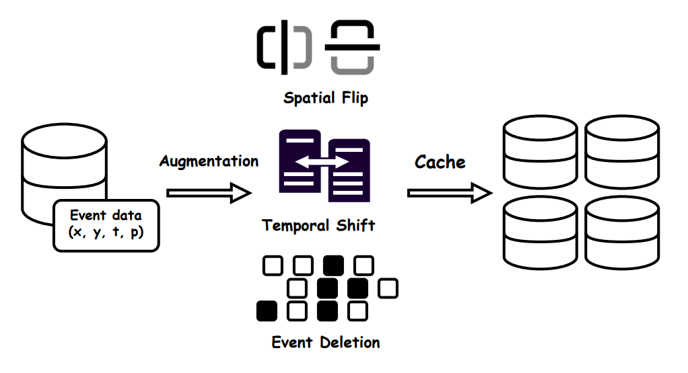

# TENNs-Eye




## Description

TENNs-Eye is a lightweight spatio-temporal network for online eye tracking with event camera, belonging to the class of [TENNs](https://brainchip.com/tenns-a-new-approach-to-streaming-and-sequential-data/) (Temporal Neural Networks) models by Brainchip. It is a causal spatio-temporal convolutional network, that can be efficiently configured for real-time inference with the use of FIFO buffers. 

### ✨ Key Enhancements  
#### **Data Augmentation Pipeline**  
<div align="center">  
  
</div>  

We introduce three novel augmentation strategies tailored for event-based eye tracking:  
1. **Temporal Shift**: Randomly shifts event timestamps within ±200ms while maintaining label alignment.  
2. **Spatial Flip**: Horizontally/Vertically flips event coordinates \((x, y)\) and inverts polarity.  
3. **Event Deletion**: Removes 5% of events based on distance-to-pupil priority to simulate occlusions.  

**Impact**:  
# Results on 3ET+ Benchmark  
Baseline (2024): 1.79 MSE  
TENNs-Eye+ (2025): 1.61 MSE ``` 